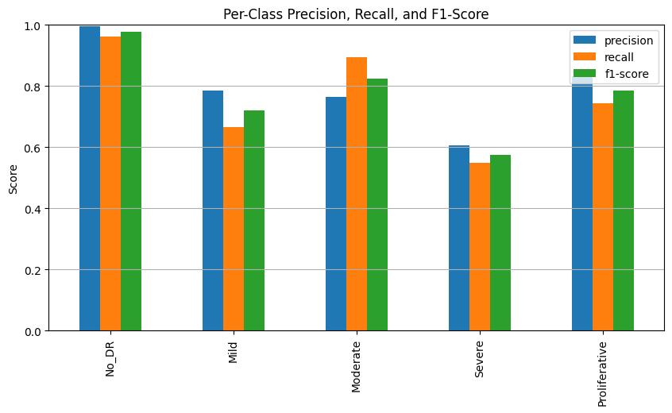

# Diabetic Retinopathy Detection using Swin Tranformer

## 📌 Project Overview

This project focuses on automated detection of **Diabetic Retinopathy (DR)** using deep learning techniques. Diabetic Retinopathy is a diabetes-related eye disease that can lead to vision loss if not detected early. The goal of this project is to build a robust image classification model that can accurately classify retinal fundus images into different DR severity levels.

The project includes data preprocessing, normalization, model training, evaluation, and deployment through a Hugging Face web application.

---

## 🚀 Live Demo

The deployed web application is available here:

🔗 [https://huggingface.co/spaces/haris018/Diabetic-retinopathy](https://huggingface.co/spaces/haris018/Diabetic-retinopathy)

Users can upload a retinal image and receive an instant prediction of the DR severity level.

---

## 📂 Dataset

The dataset used for this project is:

APTOS 2019 Blindness Detection Dataset
🔗 [https://www.kaggle.com/datasets/mariaherrerot/aptos2019](https://www.kaggle.com/datasets/mariaherrerot/aptos2019)

### Dataset Description

The dataset contains high-resolution retinal fundus images categorized into five classes:

* 0 – No DR
* 1 – Mild
* 2 – Moderate
* 3 – Severe
* 4 – Proliferative DR

The dataset required preprocessing due to variations in illumination, contrast, and image quality.

---

## 🧠 Methodology

### 1️⃣ Model: Swin Transformer

This project uses a **Swin Transformer** architecture for multi-class classification of diabetic retinopathy severity (5 classes). Transfer learning was applied using pretrained Swin weights, which were fine-tuned on the APTOS 2019 retinal fundus dataset.

---

### 2️⃣ Data Preprocessing & Augmentation

The following preprocessing and augmentation steps were applied:

* Image resizing
* Normalization
* Contrast enhancement
* Random data augmentations (e.g., geometric transforms)
* Color transformations (e.g., ColorJitter)

Example of normalized image:


---

### 3️⃣ Class Imbalance Handling

Since the APTOS dataset is imbalanced across severity classes, the following techniques were used:

* **WeightedRandomSampler** during training
* **Focal Loss** to improve learning on harder and minority-class samples

---

### 4️⃣ Training Strategy

* Transfer learning with pretrained Swin weights
* Fine-tuning on retinal dataset
* Adaptive learning rate scheduling
* Training for 15 epochs
* Validation-based performance monitoring

---

## 📊 Model Performance

### 🔹 Overall Accuracy

* **Accuracy:** 0.87 (87%)

### 🔹 Precision, Recall, F1-Score

Per-class performance metrics are shown below:



(Add numerical precision, recall, and F1-score values here from your notebook.)

---

## 🛠 Tech Stack

* Python
* PyTorch / TensorFlow (whichever used in notebook)
* NumPy
* Pandas
* Matplotlib / Seaborn
* Hugging Face Spaces (for deployment)

---

## 📁 Project Structure

```
├── Diabetic_retinopathy_(DR)__2_15ep.ipynb
├── img/
│   ├── normalized_cn.png
│   ├── per-class-prf1.png
├── README.md
```

---

## ⚙️ How to Run Locally

1. Clone the repository:

```
git clone <your-repo-link>
cd <repo-folder>
```

2. Install dependencies:

```
pip install -r requirements.txt
```

3. Run the notebook:

```
jupyter notebook Diabetic_retinopathy_(DR)__2_15ep.ipynb
```

---

## 🌐 Deployment

The model is deployed using  **Hugging Face Spaces** , allowing real-time inference through a simple web interface.

Deployment Link:
[https://huggingface.co/spaces/haris018/Diabetic-retinopathy](https://huggingface.co/spaces/haris018/Diabetic-retinopathy)

---

## 📈 Future Improvements

* Improve class imbalance handling
* Use advanced architectures (EfficientNet, Vision Transformers)
* Add Grad-CAM visualizations for interpretability
* Optimize inference time

---

## 👨‍💻 Team

Muhammad Haris Khan
Mahrukh Haseeb

---

## 📜 License

This project is for academic and research purposes only.
